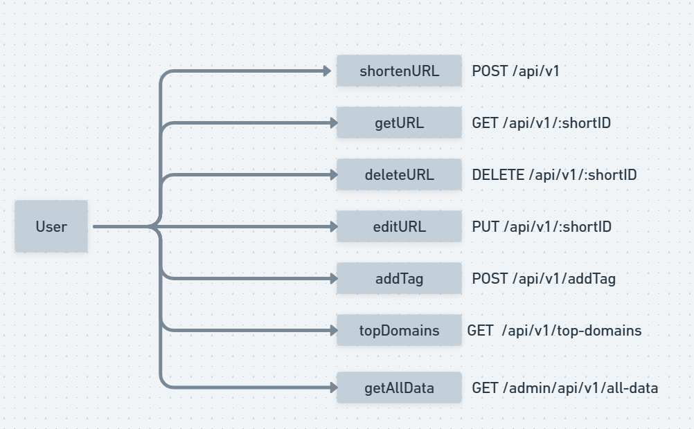
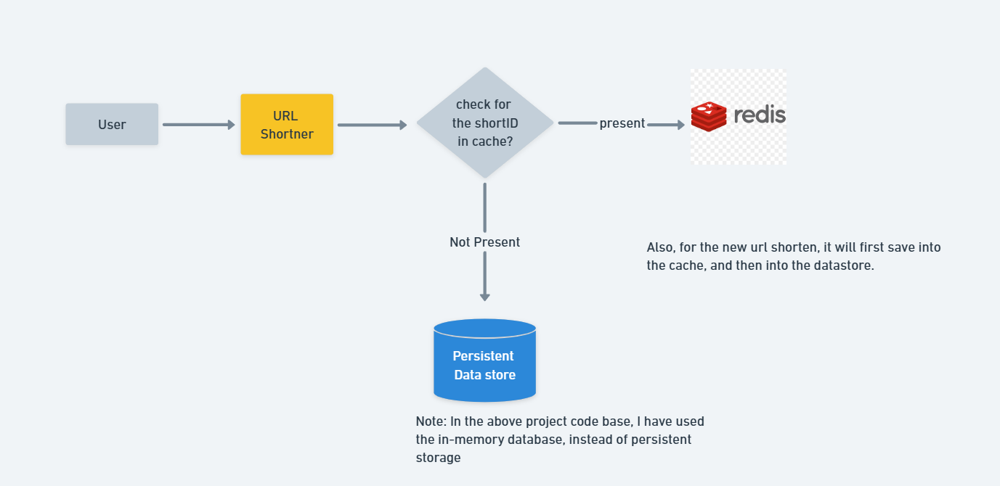

# URL Shortener Project

## Description
A URL Shortener service built with GoLang that provides the functionality to shorten URLs, track usage, and manage URL redirection. The project supports both in-memory and Redis database storage for URL data.

## Features
- Shorten URLs
- Custom short URLs
- URL expiration
- Tag management for URLs
- Rate limiting
- Top domains tracking
- In-memory and Redis support

## Architecture Diagram




## Getting Started

### Prerequisites
- GoLang 1.16 or higher
- Redis (optional, for persistent storage)
- Docker (optional, for containerized deployment)

### Installation

1. **Clone the repository:**
    ```bash
    git clone https://github.com/yourusername/url-shortener.git
    cd url-shortener
    ```

2. **Set up environment variables:**
    Create a `.env` file in the root directory and add the following variables:
    ```env
    REDIS_ADDR=localhost:6379
    API_QUOTA=100
    DOMAIN=http://localhost:8080
    APP_PORT=8080
    ```

3. **Install dependencies:**
    ```bash
    go mod tidy
    ```

### Running the Application

1. **Start the application:**
    ```bash
    go run main.go
    ```

2. **Run with Docker:**
    - Build the Docker image:
      ```bash
      docker build -t url-shortener .
      ```
    - Run the Docker container:
      ```bash
      docker run -p 8080:8080 --env-file .env url-shortener
      ```

### Running Tests
Run the tests using:
```bash
go test ./tests

```

# Untitled

## API Documentation

### Endpoints

### Shorten URL

- **Endpoint:** `/api/v1`
- **Method:** `POST`
- **Description:** Creates a shortened URL.
- **Request Body:**
    
    ```json
    {
      "url": "https://www.example.com",
      "short": "customShort",
      "expiry": 24
    }
    
    ```
    
- **Response:**
    
    ```json
    {
      "url": "https://www.example.com",
      "short": "http://localhost:8080/customShort",
      "expiry": 24,
      "rate_limit": 10,
      "rate_limit_reset": 30
    }
    
    ```
    

### Get URL by Short ID

- **Endpoint:** `/api/v1/:shortID`
- **Method:** `GET`
- **Description:** Retrieves the original URL for the given short ID.
- **Response:**
    
    ```json
    {
      "data": "https://www.example.com"
    }
    
    ```
    

### Delete URL

- **Endpoint:** `/api/v1/:shortID`
- **Method:** `DELETE`
- **Description:** Deletes the shortened URL.
- **Response:**
    
    ```json
    {
      "message": "Shortened URL Deleted Successfully"
    }
    
    ```
    

### Edit URL

- **Endpoint:** `/api/v1/:shortID`
- **Method:** `PUT`
- **Description:** Updates the original URL and expiry for the given short ID.
- **Request Body:**
    
    ```json
    {
      "url": "https://www.newexample.com",
      "expiry": 48
    }
    
    ```
    
- **Response:**
    
    ```json
    {
      "message": "The content has been Updated"
    }
    
    ```
    

### Add Tag to URL

- **Endpoint:** `/api/v1/addTag`
- **Method:** `POST`
- **Description:** Adds a tag to a shortened URL.
- **Request Body:**
    
    ```json
    {
      "shortID": "abcd12",
      "tag": "example"
    }
    
    ```
    
- **Response:**
    
    ```json
    {
      "tags": ["example"]
    }
    
    ```
    

### Get Top Domains

- **Endpoint:** `/api/v1/top-domains`
- **Method:** `GET`
- **Description:** Retrieves the top domains by usage.
- **Response:**
    
    ```json
    {
      "example.com": 5,
      "another.com": 3
    }
    
    ```
    

### Get All Data (Admin)

- **Endpoint:** `/admin/api/v1/all-data`
- **Method:** `GET`
- **Description:** Retrieves all stored URL data. Requires admin privileges.
- **Response:**
    
    ```json
    {
      "abcd12": "https://www.example.com",
      "efgh34": "https://www.another.com"
    }
    
    ```
    

## Environment Variables

- `REDIS_ADDR`: Address of the Redis server.
- `API_QUOTA`: API request quota per user.
- `DOMAIN`: Base domain for shortened URLs.
- `APP_PORT`: Port on which the application runs.

## Contributing

Contributions are welcome! Please fork the repository and submit a pull request.


## Contact

If you have any questions or suggestions, feel free to reach out to sanketbadjate36@gmail.com.


